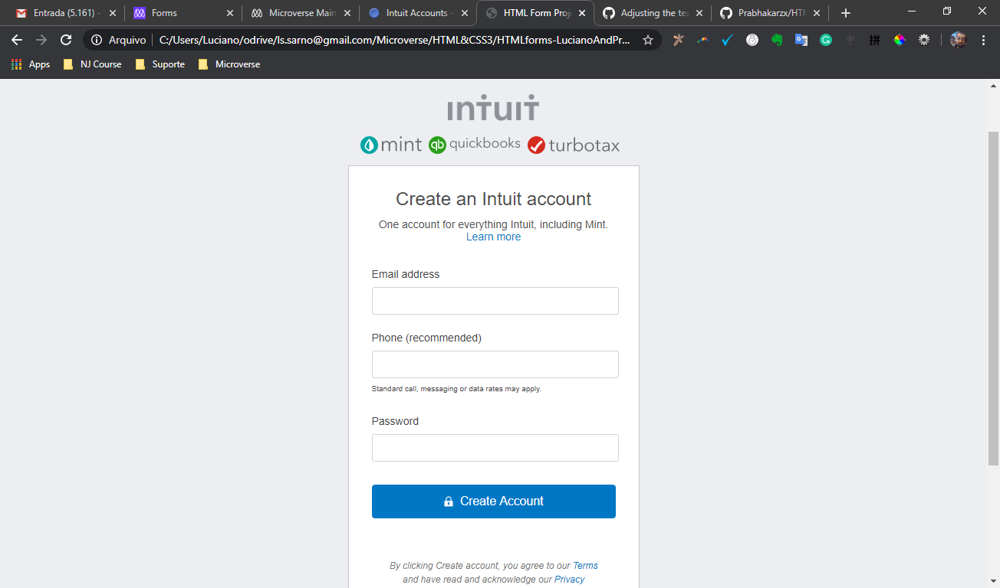

# HTML Form Project(Mint.com's SignUp Form clone)

> Luciano and Prabhakar's 2nd project in HTML&CSS3 module.

In this task we were required to create a clone of mint.com's sighnup form using the best practices of HTML AND CSS with GitHub process flow.

## Built With

- HTML,
- CSS3,

## Live Demo

[Live Demo Link](https://rawcdn.githack.com/Prabhakarzx/HTMLforms-LucianoAndPrabhakar/9d46fc7df774eb29ab2d38cb5082585b25ada8c0/index.html)

## Authors

👤 Luciano Sarno

- Github: [@githubhandle](https://github.com/lucianosarno)

👤 Prabhakar Pandey

- Github: [@githubhandle](https://github.com/Prabhakarzx)
- Twitter: [@twitterhandle](https://twitter.com/prabhakarzx)
- Linkedin: [linkedin](https://www.linkedin.com/in/prabhakarzx/)

## 🤝 Contributing

Contributions, issues and feature requests are welcome!

Feel free to check the [issues page](https://github.com/Prabhakarzx/HTMLforms-LucianoAndPrabhakar/issues)

## Show your support

Give a ⭐️ if you like this project!

## Acknowledgments

- Microverse
- GitHub
- TheOdinProject

## 📝 License

This project is open licensed.
